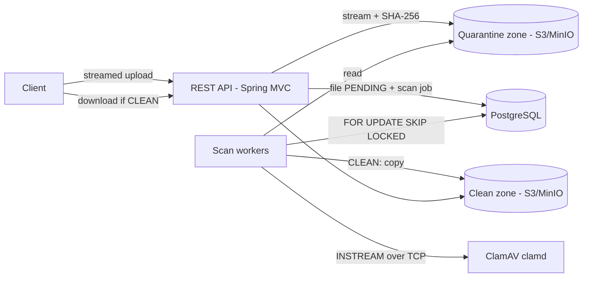

# ARCHITECTURE

## 1. Overview



File status state machine: `PENDING -> SCANNING -> CLEAN | INFECTED | FAILED`.

| Transition | Trigger |
|---|---|
| PENDING -> SCANNING | A worker leases the scan job |
| SCANNING -> CLEAN | ClamAV verdict OK (or a valid cached CLEAN verdict) |
| SCANNING -> INFECTED | ClamAV found a signature (or cached INFECTED verdict) |
| SCANNING -> FAILED | Attempts exhausted (see section 8) |
| SCANNING -> PENDING | Lease expired (dead worker) or ClamAV unavailable, job requeued |

Any other transition is rejected by the domain. Download is allowed only in `CLEAN`.

## 2. Hexagonal boundaries

```
com.msj.securefile
├── domain            pure Java: SecureFile, FileStatus, User/UserId, domain exceptions
├── application       use cases + ports (in and out), no framework
│   ├── port.in
│   └── port.out      FileStoragePort, CurrentUserProvider, ...
└── infrastructure    adapters and wiring
    ├── web           Spring MVC controllers, DTOs, MapStruct mappers
    ├── persistence   jOOQ repositories, generated jOOQ code (committed)
    ├── storage       S3/MinIO adapter
    ├── scanner       ClamAV INSTREAM client, scan workers
    └── config        Spring configuration
```

Rules (ArchUnit, see `CLAUDE.md`):
- `domain` depends on neither Spring nor jOOQ (nor any framework). Only `hypersistence-tsid` is allowed.
- `application` depends only on `domain`.
- `infrastructure` depends inward. Nothing depends on `infrastructure`.

Ports:
- `FileStoragePort`: two logical zones, `QUARANTINE` and `CLEAN`. Operations are stream-based (write with a known digest computation, read as `InputStream`, move quarantine -> clean, delete). The domain has no notion of buckets: the adapter maps zones to buckets or prefixes.
- `CurrentUserProvider`: returns the caller's `UserId`. Authentication (JWT in HttpOnly SameSite=Strict `access_token` and `refresh_token` cookies) is added later as an adapter. Until then a test stub is used.

Ownership: `SecureFile` carries its `owner: UserId`. Repositories and use cases always query with the caller's identity, so a foreign file is indistinguishable from a missing one (no IDOR).

IDs are TSIDs (`UserId(TSID value)`), stored as `BIGINT`, generated behind an `IdGenerator` port, exposed as strings in the API.

## 3. Persistence

- PostgreSQL with jOOQ. No JPA/Hibernate.
- ALL DDL is in Flyway migrations (`src/main/resources/db/migration`).
- jOOQ code is generated from the migrations against a Testcontainers PostgreSQL and **committed** under `infrastructure.persistence.jooq`. Reason: the project must compile on a machine without Docker. The `jooq-codegen` Maven profile regenerates it (needs Docker). A test checks that the committed code matches the migrations, so drift fails the build. Generated code is excluded from JaCoCo.
- MapStruct is used in `infrastructure` only (DTO <-> command, jOOQ record <-> domain).

## 4. Container-aware JVM and Direct Buffers

- Run with container support (default on modern JVMs). Size the heap as a percentage of the container limit (`-XX:MaxRAMPercentage`), leaving room for off-heap memory. Do not hard-code `-Xmx`.
- Direct (off-heap) memory is not part of the heap. NIO channels, S3 and socket I/O use direct buffers. Set `-XX:MaxDirectMemorySize` explicitly so it is bounded and predictable, and budget: `container limit >= heap + direct + metaspace + thread stacks + headroom`.
- Virtual threads are enabled (`spring.threads.virtual.enabled=true`). Blocking I/O per request is cheap, but memory per in-flight upload is not: cap concurrent uploads and scans (bulkheads/semaphores), because each holds buffers.
- Avoid pinning: no long blocking operations inside `synchronized` blocks (prefer `ReentrantLock`).
- Buffers are fixed-size and reused per stream. The number of concurrent streams times buffer size defines the direct memory need.
- Direct memory and virtual-thread metrics come in a later phase (section 10).

## 5. Stream handling

- Never buffer a whole file. Upload up to 2 GB is streamed end to end: request body -> `DigestInputStream` (SHA-256 computed on the fly) -> quarantine storage.
- Avoid framework abstractions that spool the whole request to memory or disk (for example, standard multipart handling into a temporary file). The upload must read the servlet input stream directly.
- S3 `PutObject` needs a known length, so streaming an unknown-length body uses **multipart upload** with fixed-size parts. Memory use is `part size x concurrent uploads`.
- Failures abort the multipart upload and remove partial objects. The file never becomes visible in status `PENDING` unless the upload fully succeeded and the digest is known.
- The worker streams quarantine object -> ClamAV `INSTREAM` (chunks prefixed by a 4-byte length, terminated by a zero-length chunk) over TCP. The connection has connect/read timeouts.
- ClamAV limits must exceed the largest file: `StreamMaxLength`, `MaxFileSize` and `MaxScanSize` are raised to cover 2 GB. clamd may spool the stream to its temp directory, so that volume must have enough disk space.
- Reverse proxy and Tomcat limits (request size, timeouts) must be aligned with 2 GB.

## 6. Scan-cache strategy

Cache table keyed by SHA-256, storing the verdict, the signature DB version and the scan time.

- **INFECTED is final.** A known-bad digest stays bad: no re-scan needed.
- **CLEAN is valid only for the signature version that produced it.** The worker reads the current clamd signature version (`VERSION` command: engine, signature DB number and date) before scanning. On a cache hit, a CLEAN verdict is reused if the stored signature version equals the current one. Otherwise the file is scanned again and the cache entry is replaced.
- Rationale: a fixed TTL is arbitrary. New signatures are the real reason a CLEAN verdict becomes stale, so the signature version is the invalidation key. Since signatures update several times a day, CLEAN hits are mostly effective for duplicate uploads within the same signature window.
- Not done yet (possible later): retroactive re-scan of stored CLEAN files after a signature update.

## 7. Scan job queue

- A scan job row is created in PostgreSQL in the same transaction that marks the file `PENDING`.
- Workers claim jobs with `SELECT ... FOR UPDATE SKIP LOCKED` (no contention, horizontally scalable, no broker needed). The claim sets the lease owner and expiry, and the file moves to `SCANNING`.

## 8. Queue failure handling

| Case | Behaviour |
|---|---|
| Worker dies mid-scan | The job has a **lease** (default 5 minutes) extended by heartbeat while streaming. When the lease expires, a reaper puts the job back to `PENDING` and increments the attempt counter. |
| Scan fails (I/O, timeout, protocol error) | Retry with exponential backoff (`next_attempt_at`). **Max 3 attempts**, then the file becomes `FAILED`. |
| ClamAV is down or unreachable | This is infrastructure trouble, not a file problem: the job returns to `PENDING` **without consuming an attempt**, with a backoff, and the worker pauses claiming jobs (circuit-breaker style) until clamd answers `PING`. Files are not marked `FAILED` because of an outage. |
| Duplicate execution | Idempotent: the verdict is applied only if the job lease still belongs to the worker (fenced by lease owner). |
| Manual recovery | `FAILED` is terminal for automatic processing. Requeue is a manual operation (to be specified later). |

Defaults (lease, attempts, backoff) are configuration values.

## 9. Testing strategy

- **Domain and use cases**: strict TDD. Domain tests without mocks. Use cases with Mockito on ports.
- **Architecture**: ArchUnit tests run in `mvn test` and fail on boundary violations.
- **Adapters**: integration tests (`*IT`, Failsafe) with Testcontainers: PostgreSQL (repositories, `SKIP LOCKED`, migrations) and MinIO (storage adapter). ClamAV may be a container or a fake TCP server for protocol tests.
- **Schema/codegen drift**: a test regenerates from the migrations and compares.
- **Coverage**: JaCoCo, unit + integration merged, fails below 80% instruction coverage. Excluded: jOOQ generated code, MapStruct generated implementations, configuration classes, the Application main class.
- `mvn test` needs no Docker. `mvn verify` needs Docker.

## 10. Scaling strategy

- The API is stateless: scale horizontally behind a load balancer. Files are never stored on local disk.
- Scan workers scale independently of the API: any number of workers can consume the same queue thanks to `SKIP LOCKED`. Concurrency per worker is bounded (memory/direct buffers).
- ClamAV scales by running several clamd instances behind a TCP load balancer. Each uses a lot of RAM for signatures, and scans are CPU-bound.
- Object storage scales independently (S3-compatible).
- PostgreSQL is the coordination point: index the queue on (status, next_attempt_at), keep job rows small, and purge finished jobs.

## 11. Infrastructure

Phase 1 (`docker-compose.yml`): app, PostgreSQL, MinIO (pinned image tag), ClamAV (with raised limits).

Planned for a later phase (not implemented): Prometheus, Grafana, Loki and Tempo, plus Micrometer metrics (virtual threads, direct memory, scan duration).
